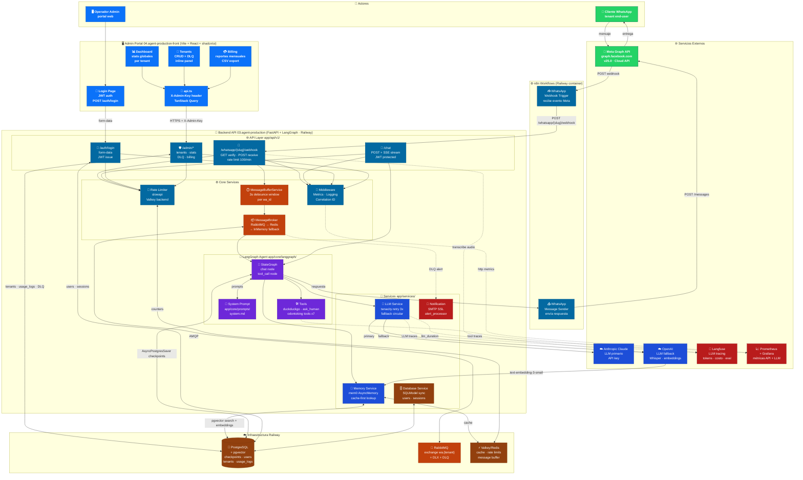

# Arquitectura de Componentes — Agent Production Platform

Vista estática de todos los servicios, cómo se agrupan y cómo se comunican entre sí. Para el flujo de actividad paso a paso ver [`whatsapp-event-flow.md`](./whatsapp-event-flow.md).

---

## Diagrama

---

## Leyenda de Colores

| Color | Capa |
|-------|------|
| 🟢 Verde | WhatsApp / Meta |
| 🔵 Azul oscuro | Admin Portal (frontend) |
| 🔵 Azul | API FastAPI / middleware |
| 🟠 Naranja | Message Broker / Buffer |
| 🟣 Violeta | LangGraph Agent |
| 🔵 Azul brillante | LLM / Memory Services |
| 🟤 Marrón | Base de datos / Persistencia |
| 🔴 Rojo | Observabilidad / Alertas |

---

## Repositorios

| Repo | Path | Tecnología |
|------|------|-----------|
| Backend | `~/09.platzi/03.agent-production` | FastAPI · LangGraph · PostgreSQL |
| Frontend | `~/09.platzi/04.agent-production-front` | Vite · React · shadcn/ui |

## Infraestructura Railway

| Servicio | Container | Notas |
|---------|-----------|-------|
| API Backend | `03.agent-production` (Dockerfile) | Puerto 8000 |
| PostgreSQL | Railway Postgres plugin | pgvector extension |
| RabbitMQ | `rabbitmq` image | Exchange por tenant |
| Valkey | Railway Redis plugin | Cache + rate limiting |
| n8n | `n8nio/n8n` image | Workflows WhatsApp |
