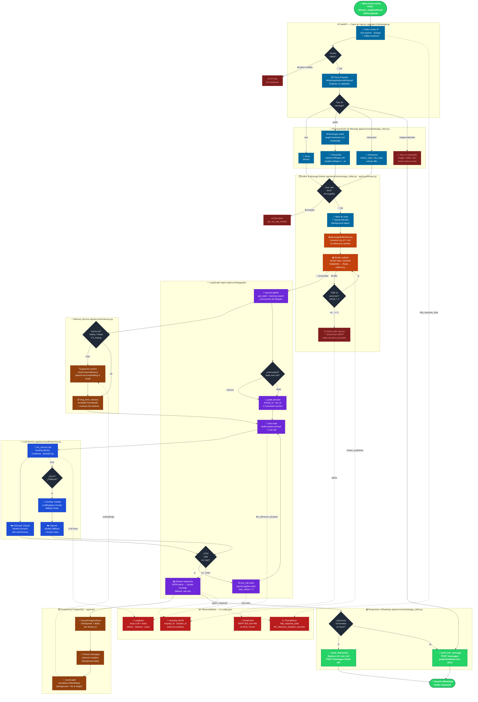

# Flujo de Evento WhatsApp → Respuesta

Diagrama completo del ciclo de vida de un mensaje: desde que Meta envía el webhook hasta que el usuario recibe la respuesta, incluyendo broker, agente LangGraph, LLM, memoria y observabilidad.

---

## Diagrama de Actividades — Flujo Completo

---

## Descripción de Capas

### 1. Ingreso (`app/api/v1/whatsapp.py`)
- **Rate limit global**: 100 req/min por IP via `slowapi` con backend Valkey
- **Verificación de tenant**: lookup en registro + comparación de `verify_token`
- **Parse Pydantic**: `WhatsAppWebhookPayload` valida estructura del webhook de Meta

### 2. Procesamiento de Mensaje (`app/services/whatsapp_client.py`)
| Tipo | Acción |
|------|--------|
| `text` | Texto directo |
| `audio` | Descarga binario → Whisper API (es) |
| `interactive` | Extrae `button_reply.title` o `list_reply.title` |
| `image/video/doc/sticker` | Envía mensaje "no soportado" |

### 3. Buffer & Broker (`app/services/message_buffer.py`, `app/core/broker.py`)
- **Debounce 3s**: acumula mensajes del mismo `wa_id` antes de procesar
- **Prioridad de broker**: `RabbitMQ (aio-pika)` → `Redis Streams` → `InMemory`
- **Retry con DLQ**: 3 intentos → Dead Letter Queue → Email alert vía SMTP

### 4. LangGraph Agent (`app/core/langgraph/`)
- **Concurrencia**: `asyncio.gather(get_state, memory.search)` evita latencia secuencial
- **Nodo `chat`**: construye prompt con memoria + llama LLM → decide si usar tools
- **Nodo `tool_call`**: ejecuta tools en paralelo → regresa a `chat`
- **Interrupts**: si `state.next` está set → `Command(resume=texto)` en vez de fresh invoke

### 5. LLM Service (`app/services/llm/service.py`)
- **Tenacity**: 3 reintentos con backoff exponencial por modelo
- **Fallback circular**: `LLMRegistry` → si modelo A falla, pasa a B, luego C, luego A
- **Timeout global**: `LLM_TOTAL_TIMEOUT = 60s` cubre todo el loop de retry+fallback

### 6. Memory Service (`app/services/memory.py`)
- **Cache-first**: busca en Valkey antes de ir a pgvector
- **mem0 AsyncMemory**: embeddings con `text-embedding-3-small`, almacenados en pgvector
- **Actualización async**: `mem0.add()` corre como background task tras cada respuesta

### 7. Persistencia (PostgreSQL)
- **`AsyncPostgresSaver`**: checkpoints del grafo por `thread_id` (= `wa_id`)
- **Historial de chat**: guardado en background, no bloquea la respuesta
- **pgvector**: almacena embeddings de memoria de largo plazo por `user_id`

### 8. Respuesta WhatsApp (`app/services/whatsapp_client.py`)
- **Detección de opciones**: regex `\d+\)\s*([^\n]+)` busca listas numeradas
- **Interactive ≤3 opciones**: botones (`button_reply`)
- **Interactive 4–10 opciones**: lista desplegable (`list_reply`)
- **Plain text**: fallback para respuestas sin opciones

### 9. Observabilidad (transversal)
| Herramienta | Qué captura |
|------------|-------------|
| **Prometheus** | `http_requests_total`, `llm_inference_duration_seconds` (histogram por modelo) |
| **Langfuse** | Trazas LLM completas: tokens input/output, latencia, costo, tool calls |
| **structlog** | Todos los eventos con `request_id`, `session_id`, `wa_id` como contexto |
| **Email alerts** | `alert_processor` en cada `logger.error()` con debounce de 300s por evento |

---

## Rutas de Error

| Error | Comportamiento |
|-------|---------------|
| Tenant inválido | HTTP 200 (evita reintentos de Meta) |
| Payload malformado | HTTP 200 + log exception |
| Audio no transcribible | Mensaje "no pude entender el audio" al usuario |
| User rate limited | Descarte silencioso + log warning |
| LLM timeout (>60s) | Mensaje "consulta tardando más de lo esperado" |
| Todos los modelos fallan | Mensaje "ocurrió un error, intente de nuevo" |
| Mensaje a DLQ | Email alert + log error + in-memory DLQ para admin panel |
