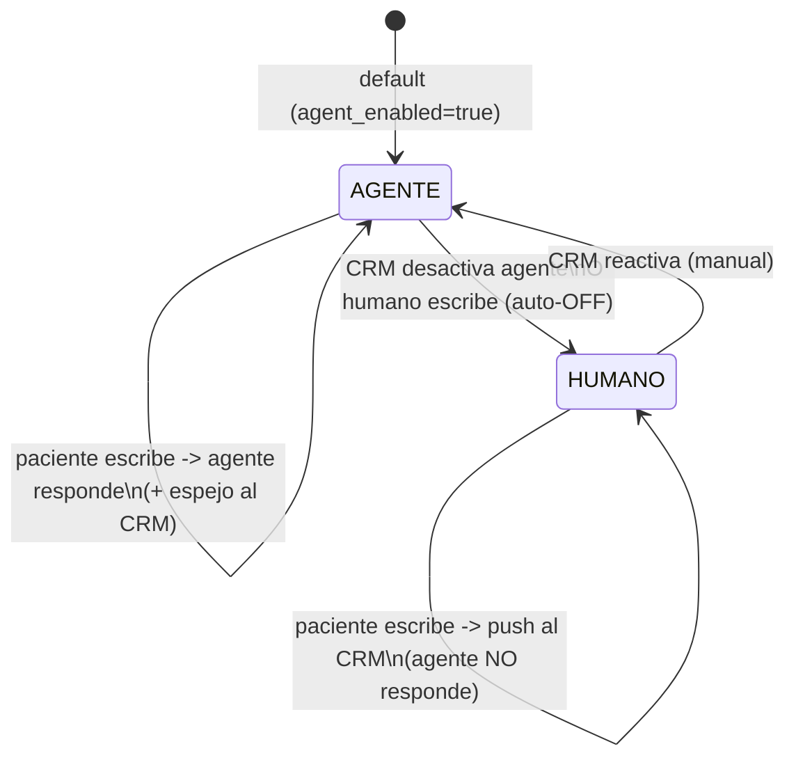
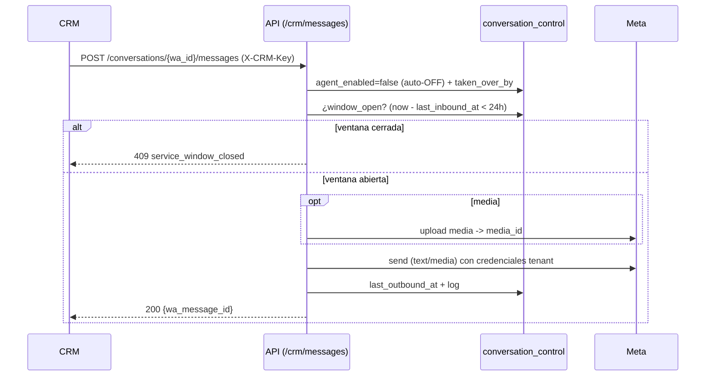

# 07 — Modo Humano / Takeover desde CRM (switch del agente por chat)

> Estado: **planeación** (sin implementar). No simplificamos ni eliminamos nada de la
> arquitectura actual; este feature se suma encima.
> Alcance: solo **odontoking** (single-tenant), aunque las tablas se llavean por
> `(tenant_slug, wa_id)` para no cerrarnos puertas.
> Fecha: 2026-06-14.

## 1. Objetivo

Permitir que un asesor/recepcionista, **desde el módulo de chat del CRM externo**, pueda:

1. **Apagar el agente por chat** (por `wa_id`) para tomar la conversación manualmente.
2. **Escribir al paciente** (texto, audio, documento) a través de nuestro número de WhatsApp.
3. **Ver en tiempo real** los mensajes entrantes del paciente (incluida media).
4. **Reactivar el agente** cuando termine.

Todo respetando la **ventana de servicio de 24 h de Meta** (sin plantillas por ahora).

## 2. Decisiones tomadas (confirmadas)

| Tema | Decisión |
|------|----------|
| Estado on/off | **Nuestra DB es la fuente de verdad**, controlada por endpoints REST que el CRM llama. |
| Entrada al CRM | **Push**: por cada mensaje entrante hacemos `POST` al webhook del CRM. |
| Media | **Almacenar y servir URL**: descargamos de Meta, guardamos, entregamos URL propia; salida = subimos a Meta. |
| Reactivación | **Auto-OFF cuando un humano escribe** desde el CRM + **reactivación manual**. |

## 3. Concepto clave: estado por conversación

Cada chat (`wa_id`) tiene un estado de control independiente de LangGraph:



- **AGENTE (on):** flujo actual intacto (webhook → buffer → `OdontokingAgent` → respuesta).
  Además **espejamos** entrante y respuesta del agente al CRM para que el chat muestre todo.
- **HUMANO (off):** el agente **no** procesa; el entrante se hace **push** al CRM y el asesor
  responde por nuestro endpoint.

## 4. Modelo de datos (nuevas tablas)

### 4.1 `conversation_control` (núcleo del switch)
| Campo | Tipo | Notas |
|-------|------|-------|
| `id` | PK | |
| `tenant_slug` | varchar | default `odontoking` |
| `wa_id` | varchar | único junto con tenant |
| `agent_enabled` | bool | default `true` |
| `last_inbound_at` | timestamptz | para ventana 24 h |
| `last_outbound_at` | timestamptz | |
| `taken_over_by` | varchar null | id/nombre del asesor |
| `taken_over_at` | timestamptz null | |
| `created_at` / `updated_at` | timestamptz | |

Índice único `(tenant_slug, wa_id)`.

### 4.2 `media_asset` (almacenamiento de media)
| Campo | Tipo | Notas |
|-------|------|-------|
| `id` | uuid PK | se usa en la URL servida |
| `tenant_slug`, `wa_id` | varchar | |
| `direction` | enum inbound/outbound | |
| `meta_media_id` | varchar null | id original de Meta (entrante) |
| `mime_type` | varchar | |
| `storage_path` | varchar | disco/S3 |
| `sha256` | varchar | dedupe |
| `created_at`, `expires_at` | timestamptz | retención |

### 4.3 `conversation_message` (opcional pero recomendado — historial unificado)
Registro de TODO (entrante paciente, salida agente, salida humano) para el historial del
CRM y auditoría. Hoy `chat_histories_odonto` solo guarda lo del agente; los mensajes en
modo humano y los entrantes durante takeover no quedan. Campos: `wa_id`, `direction`,
`sender` (patient/agent/human:<asesor>), `type`, `text`, `media_asset_id`, `wa_message_id`,
`created_at`.

> Migraciones Alembic: una por tabla (`make migration MSG=...`). Reversibles.

## 5. Contrato de API

### 5.1 Endpoints que el CRM CONSUME (CRM → nosotros)
Prefijo sugerido: `/api/v1/crm` · Auth: header **`X-CRM-Key`** (comparación con `hmac.compare_digest`).

| Método | Ruta | Para qué |
|--------|------|----------|
| `POST` | `/conversations/{wa_id}/agent` | Body `{enabled: bool, advisor?: str}` → activar/desactivar agente. |
| `GET` | `/conversations/{wa_id}/status` | Devuelve `{agent_enabled, last_inbound_at, window_open, window_expires_at, taken_over_by}`. |
| `POST` | `/conversations/{wa_id}/messages` | Enviar mensaje del asesor al paciente. **Auto-OFF del agente.** Body: `{type: text\|image\|audio\|document, text?, media_url?, caption?, advisor}`. `advisor` se registra **solo para auditoría** (NO se muestra en el WhatsApp del paciente). |
| `GET` | `/conversations/{wa_id}/messages` | (opcional) Historial paginado para reconciliar. |
| `GET` | `/media/{asset_id}` | Servir media entrante al CRM (autenticada o URL firmada). |
| `POST` | `/conversations/{wa_id}/read` | (opcional) Marcar como leído. |

**Reglas del `POST /messages`:**
1. Si el agente estaba ON → lo apaga (`agent_enabled=false`, `taken_over_by=advisor`).
2. Valida **ventana 24 h**: si está cerrada → `409`/`422` con `{error: "service_window_closed", window_expires_at}` (no enviamos porque no usamos plantillas).
3. Sube media a Meta si aplica → envía por WhatsApp con credenciales del tenant.
4. Registra en `conversation_message` y actualiza `last_outbound_at`.

### 5.2 Endpoint que NOSOTROS llamamos (nosotros → CRM, push)
`POST {CRM_WEBHOOK_URL}` firmado con HMAC (`X-Signature`, secreto compartido) por cada
evento. Payload:
```json
{
  "event": "message_in | message_out | agent_toggled | takeover_started",
  "tenant": "odontoking",
  "wa_id": "5917xxxxxxx",
  "profile_name": "Juan",
  "direction": "inbound|outbound",
  "type": "text|audio|document|image|interactive",
  "text": "...",
  "media_url": "https://.../api/v1/crm/media/<uuid>",
  "wa_message_id": "wamid...",
  "agent_enabled": false,
  "timestamp": "2026-06-14T15:04:05Z"
}
```
Con reintentos (tenacity, backoff) y, si falla persistente, a una cola/log para reproceso.

## 6. Flujos

### 6.1 Entrante con agente OFF (modo humano)
```mermaid
sequenceDiagram
    actor P as Paciente
    participant M as Meta
    participant W as Webhook (whatsapp.py)
    participant DB as conversation_control
    participant S as media_store
    participant CRM as CRM (webhook)
    P->>M: mensaje (texto/audio/doc)
    M->>W: POST /{tenant}/webhook
    W->>W: dedup + mark_as_read
    W->>DB: upsert last_inbound_at; lee agent_enabled
    alt media
        W->>M: download_media
        W->>S: guardar + generar URL
    end
    Note over W: agent_enabled = false
    W-->>M: 200 OK
    W->>CRM: push message_in (texto + media_url)
    Note over W: el agente NO se ejecuta
```

### 6.2 Salida del asesor (CRM → paciente)


### 6.3 Entrante con agente ON (sin cambios funcionales + espejo)
Igual al flujo actual, pero además: `upsert last_inbound_at` y `push message_in`/`message_out`
al CRM para que el chat muestre la conversación. **Re-chequear `agent_enabled` justo antes
de enviar la respuesta del agente** (por si el humano tomó el control durante el LLM).

### 6.4 ¿Qué es "espejar" (mirroring)? — aclaración

**Espejar = reenviar al CRM una copia de cada mensaje** (vía el `POST {CRM_WEBHOOK_URL}` de
§5.2) para que el módulo de chat del CRM muestre la conversación en tiempo real. No es un
canal nuevo: es el mismo push, disparado en más momentos.

- **Mecánica:** cuando entra un mensaje del paciente disparamos un push `message_in`; cuando
  el agente (o el humano) envía, disparamos `message_out`. Es fire-and-forget con reintentos.
- **En modo HUMANO (agente OFF):** el push de entrantes es **obligatorio** (sin él, el asesor
  no ve qué escribe el paciente). Esto siempre ocurre.
- **En modo AGENTE (agente ON):** el espejo es **opcional**. Dos alternativas:
  - **Espejar siempre (recomendado):** el CRM ve TODA la conversación (paciente + bot) aunque
    el agente la esté manejando. Cuando el asesor entra, ya tiene el contexto completo. Costo:
    más llamadas push.
  - **Espejar solo en modo humano:** el CRM solo ve la conversación desde que el asesor toma
    el control. Más barato, pero el asesor entra "a ciegas" sin ver qué dijo el bot.
- **Decisión:** se implementa **espejar siempre**, con flag `CRM_MIRROR_AGENT_MODE`
  (default `true`) para poder apagarlo sin tocar código.

## 7. Ventana de 24 h de Meta (sin plantillas)

- Cada mensaje **entrante** del paciente abre/renueva 24 h de "ventana de servicio".
- Dentro de la ventana: podemos enviar texto/media libres (agente y humano).
- Fuera de la ventana: Meta **rechaza** mensajes libres (solo plantillas, que **no usamos**)
  → bloqueamos en el endpoint y devolvemos `window_expires_at` para que el CRM avise al asesor.
- `GET /status` expone `window_open` y `window_expires_at` para que la UI del CRM lo muestre.
- Implementación: `last_inbound_at` en `conversation_control`; `WHATSAPP_SERVICE_WINDOW_HOURS=24` configurable.

## 8. Media (texto, audio, documentos, imágenes)

- **Entrante:** hoy el webhook **rechaza** imágenes/documentos/video con `_UNSUPPORTED_MSG`
  ([whatsapp.py](../app/api/v1/whatsapp.py)). Cambia a: **descargar + almacenar + push al CRM**
  (el humano sí puede verlos). El **agente** sigue sin procesar imágenes/documentos (solo
  texto y audio transcrito), pero ya no se pierden: quedan para el CRM.
- **Almacenamiento:** `media_store` (disco local en dev, S3 en prod), URL servida por
  `GET /api/v1/crm/media/{id}` (autenticada o URL firmada — la media es PII, no pública).
  **Retención: se mantiene indefinidamente** (sin borrado automático por ahora). Dejar el
  parámetro de retención preparado pero desactivado (`MEDIA_RETENTION_DAYS=0` = no borrar).
- **Saliente:** `whatsapp_client` hoy solo tiene `download_media`. Hay que **añadir**:
  `upload_media` (POST `/{phone_id}/media`) + `send_image/send_audio/send_document`
  (referenciando `media_id`). Reutilizar el patrón de `send_text_message`.
- **Audio entrante:** en modo agente se transcribe (Whisper, ya existe); en modo humano
  basta almacenar y enviar la URL (transcripción opcional como conveniencia para el asesor).

## 9. Puntos de integración en el código actual

| Archivo | Cambio |
|---------|--------|
| [app/api/v1/whatsapp.py](../app/api/v1/whatsapp.py) | En `_handle_webhook_payload`: upsert `last_inbound_at`; leer `agent_enabled`; push al CRM; si OFF, **no** encolar al agente; aceptar media (no rechazar) → almacenar + push. |
| **nuevo** `app/api/v1/crm.py` (o `app/api/crm/`) | Router con los endpoints de §5.1; auth `X-CRM-Key`. Registrar en [app/main.py](../app/main.py). |
| **nuevo** `app/services/conversation_control.py` | CRUD del flag + cálculo de ventana 24 h. |
| **nuevo** `app/services/crm_push.py` | Push al webhook del CRM con HMAC + tenacity. |
| **nuevo** `app/services/media_store.py` | Guardar/servir media (disco/S3) + retención. |
| [app/services/whatsapp_client.py](../app/services/whatsapp_client.py) | Añadir `upload_media`, `send_image/audio/document`. |
| **nuevos** `app/models/conversation_control.py`, `media_asset.py`, (`conversation_message.py`) | + migraciones Alembic. |
| [app/core/config.py](../app/core/config.py) | Nuevas vars (§11). |
| [app/core/langgraph/odontoking_graph.py](../app/core/langgraph/odontoking_graph.py) | Re-chequear `agent_enabled` antes de enviar la respuesta del agente. |

> Nota arquitectura: el chequeo del switch va en el **webhook** (ruta in-process que usa
> odontoking hoy). Si en el futuro se usa la ruta broker→worker, replicar el chequeo en
> [app/worker.py](../app/worker.py).

## 10. Seguridad

- **`X-CRM-Key`** para todos los endpoints CRM (compare_digest); idealmente distinta del `X-Admin-Key`.
- **HMAC** en el push nuestro→CRM (`X-Signature`) para que el CRM confíe en el origen.
- **Media privada:** URLs autenticadas o firmadas con expiración (no exponer media de pacientes).
- **Verificar firma del webhook de Meta** (`X-Hub-Signature-256`) — ya recomendado en la
  auditoría; cobra más importancia ahora que mezclamos tráfico CRM/agente.
- Rate limiting en todos los endpoints CRM. No loguear contenido sensible/PII en INFO.

## 11. Configuración nueva (`.env` / `config.py`)

```
CRM_PUSH_ENABLED=true
CRM_WEBHOOK_URL=https://crm.example.com/whatsapp/inbound
CRM_WEBHOOK_SECRET=<hmac-secret>
CRM_API_KEY=<key-que-el-crm-usa-con-X-CRM-Key>
WHATSAPP_SERVICE_WINDOW_HOURS=24
MEDIA_STORAGE_BACKEND=local        # local | s3
MEDIA_DIR=/data/media              # backend local
MEDIA_BASE_URL=https://api.example.com
MEDIA_RETENTION_DAYS=0             # 0 = sin borrado (mantener indefinidamente)
CRM_MIRROR_AGENT_MODE=true         # espejar también cuando el agente está ON
# S3 (si aplica): MEDIA_S3_BUCKET, MEDIA_S3_REGION, claves...
```

## 12. Plan por fases

### Fase A — Switch + estado (MVP, solo texto)
- Modelo `conversation_control` + migración.
- `conversation_control` service (get/set flag, ventana 24 h).
- Auth `X-CRM-Key`; endpoints `POST /agent`, `GET /status`.
- Hook en webhook: upsert `last_inbound_at`, leer flag, si OFF no ejecutar agente.
- `crm_push` service + push de `message_in` (texto) al CRM.
- **Salida:** el CRM puede apagar/encender el agente y recibir entrantes de texto.

### Fase B — Mensajería saliente del asesor (texto) + ventana 24 h
- `POST /conversations/{wa_id}/messages` (texto), auto-OFF, validación de ventana.
- Re-chequeo de `agent_enabled` antes de enviar respuesta del agente.
- Espejo de respuestas del agente al CRM (`message_out`).
- **Salida:** takeover humano funcional end-to-end con texto.

### Fase C — Media (audio, documentos, imágenes)
- `media_store` + `GET /media/{id}`; dejar de rechazar media en el webhook → almacenar + push.
- `upload_media` + `send_image/audio/document` en `whatsapp_client`.
- `POST /messages` soporta media (CRM manda `media_url`).
- **Salida:** conversación completa multimedia en ambos sentidos.

### Fase D — Endurecimiento
- HMAC en push, retención/expiración de media, idempotencia (`wa_message_id`),
  `conversation_message` (historial unificado) + `GET /messages`, métricas Prometheus
  (mensajes por modo, ventana cerrada, fallos de push), verificación firma Meta, tests, y
  **doc de integración para el CRM** (OpenAPI + ejemplos).

## 13. Tests (criterios de aceptación)
- Toggle ON/OFF persiste y `GET /status` lo refleja.
- Entrante con agente OFF: NO invoca al agente y SÍ hace push al CRM.
- `POST /messages` apaga el agente (auto-OFF) y envía a WhatsApp.
- Ventana cerrada → `POST /messages` devuelve `service_window_closed`.
- Media entrante se almacena y la URL es accesible solo autenticada.
- Re-chequeo: si el humano toma el control mientras el LLM corre, el agente no envía.
- Regresión: con agente ON y sin CRM configurado, el flujo actual no cambia.

## 14. Decisiones resueltas y supuestos

**Resueltas (ronda 2):**
- **Espejo:** se espeja **siempre** (agente ON y OFF), configurable con `CRM_MIRROR_AGENT_MODE`
  (default `true`). Ver §6.4 para la mecánica.
- **Asesor:** `advisor` se guarda **solo para auditoría**; NO se inserta en el texto que recibe
  el paciente en WhatsApp.
- **Retención de media:** se **mantiene indefinidamente** (sin borrado automático); parámetro
  preparado pero en `0`.

**Supuestos vigentes:**
- Una sola "ventana 24 h" global por chat (Meta la maneja así).

**Pendiente menor (no bloquea):**
- ¿El CRM necesita historial vía `GET /messages` (Fase D / Sprint Media) o le basta el push?
  Se deja el endpoint como opcional.
```
